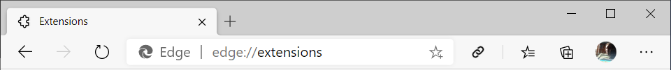
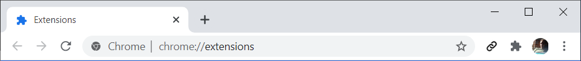
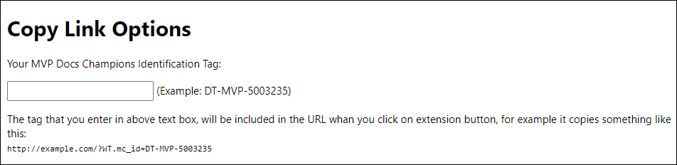

## Copy page URL including MVP Docs Champions Id

Sometimes you have a page URL like the following, which contains a few query string and #:  
[https://docs.microsoft.com/en-us/dotnet/api/system.globalization.datetimeformatinfo.monthnames?view=netframework-4.8#System_Globalization_DateTimeFormatInfo_MonthNames](https://docs.microsoft.com/en-us/dotnet/api/system.globalization.datetimeformatinfo.monthnames?view=netframework-4.8#System_Globalization_DateTimeFormatInfo_MonthNames)

And you want to copy the URL including your Id, which means basically adding a query string like WT.mc_id=DT-MVP-5003235 without breaking the URL, like this:   

[https://docs.microsoft.com/en-us/dotnet/api/system.globalization.datetimeformatinfo.monthnames?***WT.mc_id=DT-MVP-5003235***&view=netframework-4.8#System_Globalization_DateTimeFormatInfo_MonthNames](https://docs.microsoft.com/en-us/dotnet/api/system.globalization.datetimeformatinfo.monthnames?WT.mc_id=DT-MVP-5003235&view=netframework-4.8#System_Globalization_DateTimeFormatInfo_MonthNames)

It's not easy to change the URL manually without breaking it, also keeping the Id in clipboard or elsewhere. Right?  

This plugin makes it easy to copy the URL of the pages including your MVP Docs Champions Identification Tag in the complex URLs having some query strings or #. 
After you install it, it adds a button to the Microsoft Edge or Google Chrome toolbar and it's enough to click on the button to copy the URL of the page, including your Id. It has also an option page which allows you to setup your Id to be used when copying the URL.

## Installation
Since I haven't published this plugin to Microsoft/Chrome store, you can download/clone it from here and manually add it to your browser. To do so:

1. Download or clone the repository.
2. Browse extensions setting of your browser. It's edge://extensions or chrome://extensions
3. Enable Developer mode.
4. Click on Load unpacked and browse to the repository folder and select it.
5. In Microsoft Edge you will see the icon of the extension in toolbar. In chrome, you need to pin it by clicking on extensions icon and click on the pin icon in front of the extension in the list of extensions.
 
 

6. To set up your Id, browse the extension options page by right clicking on the extension icon and choosing Extension options. Then enter your MVP Docs Champions Identification Tag in the text box and it will be saved automatically.
  
 

Later when you browse a page, for example https://docs.microsoft.com/en-us/ when you click on the extension button to copy the URL, it will include the query string for MVP docs champions like https://docs.microsoft.com/en-us/?WT.mc_id=DT-MVP-5003235. It also cares about other query strings and # in the URL.
